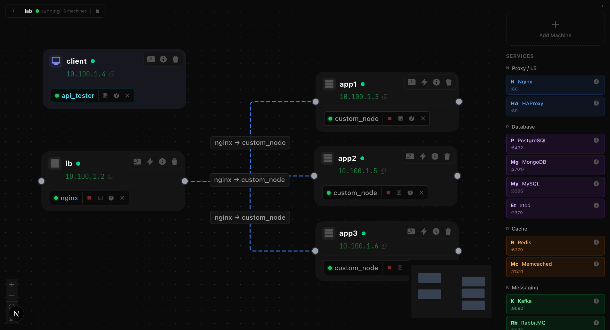

# DistSim

**Learn distributed systems by building and breaking real infrastructure.**

<p align="center">
  
</p>

Most engineers learn distributed systems from blog posts, diagrams, and theoretical papers. They understand the concepts but have never actually configured a load balancer, set up database replication, injected network latency, or debugged a cascading failure across multiple services. DistSim changes that.

DistSim gives you a complete lab environment on your own machine. Each "machine" is a real Linux container with a real terminal — you install services, write configs, deploy code, and connect everything yourself. Then you break it with chaos engineering and watch what happens. No cloud account. No VPS bill. No risk.

## Why This Exists

Every tech company — from 3-person startups to Netflix — runs the same 6 layers of infrastructure:

```
Traffic Entry → Orchestration → Service Mesh → Data → Messaging → Observability
```

But unless you work at one of these companies, you never get to see the full picture. You read about Nginx load balancing but never configure `upstream` blocks across 3 app servers. You know Redis is a cache but have never tested what happens when you kill the cache and 10x traffic hits the database directly. You understand Kafka processes events but have never set up a producer, consumer, and dead letter queue.

DistSim lets you do all of that in 10 minutes on your laptop.

## What You Get

**Real machines** — each one is a full Ubuntu Linux environment with bash, curl, vim, tcpdump, strace, and every tool you need. SSH in through the browser terminal.

**22 services** — install, configure, start, stop, and connect real software:

| Category | Services |
|----------|----------|
| Proxy / LB | Nginx, HAProxy |
| Database | PostgreSQL, MySQL, MongoDB, etcd |
| Cache | Redis, Memcached |
| Messaging | Kafka, RabbitMQ, NATS |
| Search | Elasticsearch |
| Storage | MinIO (S3-compatible) |
| Discovery | Consul |
| Security | Vault |
| Observability | Prometheus, Grafana, Jaeger |
| Custom Code | Go, Node.js, Python |

**Visual topology editor** — drag machines onto a canvas, connect them, see the architecture. Not a diagram — a live system.

**Code editor** — write Go, Node.js, or Python services in the browser with Monaco (VS Code engine). Run and stop with one click.

**Chaos engineering** — inject network delay, packet loss, partitions. Kill processes. Stress CPU and memory. Fill disks. Watch your system degrade and learn to make it resilient.

**API tester** — built-in Postman-like tool with load testing. Send single requests or blast 10,000 concurrent requests through your load balancer.

**Comprehensive help** — every service has a `?` button with installation commands, full configs, code examples, and production best practices. 65 ready-to-use code examples across all services.

## Quick Start

### Option 1: Clone and Install

```bash
git clone https://github.com/hamidlabs/distsim.git
cd distsim
bash install.sh
```

### Option 2: Manual Setup

```bash
# Prerequisites: Docker, Go 1.22+, Node.js 20+

# Build the base machine image
cd distsim
docker build -t distsim-base:latest ./containers/base

# Start backend
cd backend
go build -o bin/server ./cmd/server/
./bin/server &

# Start frontend
cd ../frontend
pnpm install && pnpm build
npx next start -p 3000 &

# Open http://localhost:3000
```

### Option 3: Use the CLI After Install

```bash
distsim start       # Start everything
distsim stop        # Stop everything
distsim status      # Check what's running
distsim dev         # Dev mode with hot reload
distsim logs        # View logs
distsim restart     # Restart
distsim clean       # Remove Docker images
distsim uninstall   # Remove completely
```

## Prerequisites

| Tool | Version | Install |
|------|---------|---------|
| Docker | 20+ | `curl -fsSL https://get.docker.com \| sh` |
| Go | 1.22+ | `sudo dnf install golang` or [go.dev/dl](https://go.dev/dl/) |
| Node.js | 20+ | `sudo dnf install nodejs` or [nodejs.org](https://nodejs.org) |
| pnpm | any | `npm install -g pnpm` (optional — npm works too) |

## What You'll Learn

### Beginner: "What is all this?"

Create a **Small Company** lab. You get 3 machines: app server, database primary, database replica. Install Nginx on the app server, PostgreSQL on the database machines. Configure Nginx to proxy requests to your Node.js app. Connect the app to the database. Send requests through the load balancer. See everything work. Then kill the database and watch what breaks.

### Intermediate: "How do companies scale?"

Create a **Medium Company** lab. 10 machines with a load balancer, 3 app servers, database with replication, Redis cache, and 3 Kafka brokers. Configure Nginx round-robin across the app servers. Set up Redis caching so repeated reads don't hit the database. Publish events to Kafka when orders are placed. Build a notification service that consumes those events. Inject 500ms network delay on one app server and watch the load balancer route around it.

### Advanced: "How do I make this resilient?"

Create a **Large Company** lab. 16 machines with the full stack. Set up Prometheus to scrape metrics from all services. Build Grafana dashboards showing request rate, error rate, and p99 latency. Configure circuit breakers in your code. Inject chaos: kill the primary database, watch the replica promote, verify zero data loss. Partition the Kafka cluster and observe how consumers handle it. Fill a disk on the Redis server and watch cache evictions kick in.

## Architecture

```
Browser (localhost:3000)
│
├── Next.js frontend
│   ├── React Flow canvas (visual topology editor)
│   ├── xterm.js terminals (real SSH to containers)
│   ├── Monaco code editor (write services)
│   ├── Chaos panel (inject failures)
│   └── API tester (send requests + load test)
│
└── Go backend API (localhost:8080)
    ├── Docker Engine API
    │   ├── Isolated bridge network per lab session
    │   ├── Ubuntu containers with NET_ADMIN capability
    │   └── Full lifecycle: create, start, exec, stop, remove
    ├── Type-safe connection validation
    ├── Chaos engine (tc, iptables, stress-ng)
    ├── Terminal bridge (WebSocket ↔ docker exec)
    └── In-memory session store
```

## Built With

| Component | Technology |
|-----------|-----------|
| Frontend | Next.js 15, React, TypeScript, Tailwind CSS |
| Canvas | React Flow (xyflow) |
| Terminal | xterm.js + WebSocket |
| Code Editor | Monaco Editor |
| Backend | Go, chi router |
| Containers | Docker Engine API (Go SDK) |
| State | Zustand (frontend), in-memory (backend) |

## Project Structure

```
distsim/
├── backend/                 # Go API server
│   ├── cmd/server/          # Entry point
│   ├── internal/
│   │   ├── handler/         # HTTP handlers
│   │   ├── domain/          # Data models + session store
│   │   ├── docker/          # Docker SDK wrapper
│   │   ├── chaos/           # Chaos engineering engine
│   │   ├── terminal/        # WebSocket terminal bridge
│   │   └── typesys/         # Connection type safety
│   └── Dockerfile
├── frontend/                # Next.js app
│   ├── app/                 # Pages (home, labs, learn, session)
│   ├── components/          # UI components
│   │   ├── canvas/          # React Flow nodes, edges, toolbar
│   │   ├── editor/          # Code editor, config panel, API tester
│   │   ├── terminal/        # Terminal panel + tabs
│   │   ├── chaos/           # Chaos panel + actions
│   │   └── observability/   # Health overlay, log viewer
│   ├── stores/              # Zustand state management
│   ├── lib/                 # API client, types, constants, service hints
│   └── Dockerfile
├── containers/
│   └── base/Dockerfile      # Ubuntu base image with tools
├── install.sh               # One-command installer
├── Makefile                  # Build targets
└── docs/                    # Learning content + plans
```

## Contributing

1. Fork and clone
2. `bash install.sh`
3. `distsim dev` (starts with hot reload)
4. Make changes
5. `distsim stop && distsim start` to test production build
6. Open a PR

## License

MIT
